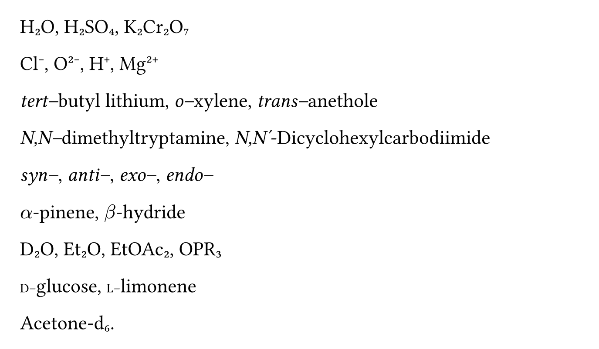

# The `chem-par` Package
<div align="center">Version 0.2.0</div>

A utility package for displaying IUPAC nomenclature and chemical formulae without the hassle of manually formatting all of these in your document.

## Example Usage

```typ
#import "@preview/chem-par:0.2.0": *

#set page(width: 30em, height: auto, margin: 1em)
#show: chem-style

The oxidation of n-butanol with K2Cr2O7 requires acidification with H2SO4 to yield butanoic acid. N,N-dimethyltryptamine.
```


Works on most of the common things a chemist would type

